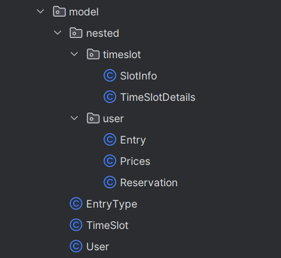
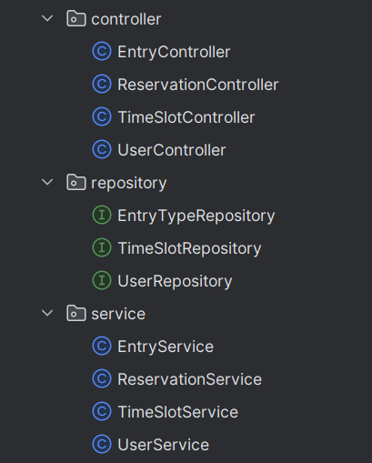

# Climbing Gym

### Autorzy: Zuzanna Jedynak i Jakub Prygiel

Projekt na Bazy Danych 2. Został zrealizowany z użyciem nierelacyjnej bazy MongoDB, a implementacje działania CRUD i HTTP zostały napisane w Javie z pomocą Spring Boot'a.

---

## Zamysł bazy danych

Baza danych to system rezerwacji na ściankę wspinaczkową. Składa się z trzech kolekcji: `users`, `time_slots` oraz `entry_types`. Wykorzystaliśmy właściwości dokumentowego formatu MongoDB i użyliśmy zagnieżdżeń aby utrzymać więcej informacji w pojedynczych tabelach.

#### `users`

```json
{
  "id": "u1",
  "firstname": "Harry",
  "lastname": "Potter",
  "entries": [
    {
      "type": "Regular",
      "prices": {
        "regular": 35.0,
        "reduced": 20.0
      },
      "deadline": "2025-07-20",
      "amount": 3,
      "entry_id": "e1"
    }
  ],
  "reservations": [
    {
      "reservationId": "r1",
      "date": "2025-07-01",
      "status": "A",
      "day_time": "morning",
      "people_amount": 3
    }
  ],
  "register_date": "2024-01-15"
}
```

Każdy użytkownik poza podstawowymi informacjami jak imię, nazwisko, posiada także dwie listy. Listę `entries` trzymającą wszystkie zakupione wejściówki oraz listę `reservations` trzymającą wszystkie wykonane przez użytkownika rezerwacje na ściankę wspinaczkową.

#### `time_slots`

```json
{
  "id": "ts_2025-07-01",
  "date": "2025-07-01",
  "details": {
    "morning": {
      "maxSlots": 20,
      "reservedSlots": 3
    },
    "noon": {
      "maxSlots": 30,
      "reservedSlots": 0
    },
    "evening": {
      "maxSlots": 20,
      "reservedSlots": 0
    }
  }
}
```

Rezerwacje są jedynie na konkretną porę dnia, stąd w `time_slots` przetrzymywane są dni z podziałem na ranek, południe i wieczór.

#### `entry_types`

```json
{
  "id": "684d6d6e91f03f5ae49b5260",
  "name": "Four entries",
  "prices": {
    "regular": 110.0,
    "reduced": 90.0
  },
  "uses": 4,
  "entry_type": "4_entries",
  "day_limit": 30
}
```

Kolekcja utrzymująca wszystkie możliwe do zakupienia wejściówki, trzyma informacje o cenach, ilości wejść, oraz ograniczeniu czasowym na wykorzystanie.

## Implementacja backend'u

Najpierw zostały stworzone klasy przetrzymujące obiekty z bazy.



Klasy `User`, `TimeSlot` i `EntryType` są oznaczone adnotacją `@Document`, co informuje Spring Data MongoDB, że odpowiadają konkretnym kolekcjom w bazie danych. Dzięki temu framework automatycznie mapuje obiekty tych klas na dokumenty w MongoDB i umożliwia ich zapisywanie oraz odczytywanie z odpowiednich kolekcji.

```java
@Document(collection = "users")
public class User {
    public User(){}

    @Id
    private String id;
    private String firstname;
    private String lastname;
    @JsonProperty("register_date")
    @Field("register_date")
    private LocalDate registerDate;
    private List<Entry> entries;
    private List<Reservation> reservations;

    // GETTERS AND SETTERS
    ...
}
```

### Obsługa HTTP

Następnie dla każdej kolekcji powstało `Repository`, `Service` i `Controller`.



1. `Repository` to interfejsy dziedziczące po `MongoRepository`, które automatycznie udostępniają gotowe metody do podstawowych operacji CRUD (create, read, update, delete). Dodatkowo pozwalają definiować własne, proste metody zapytań, oparte na nazwach metod, bez potrzeby pisania ich ręcznie.

   ```java
   @Repository
   public interface TimeSlotRepository extends MongoRepository<TimeSlot, String> {
       Optional<TimeSlot> findByDate(LocalDate date);
   }
   ```

2. `Service` to klasy zajmujące się główną logiką aplikacji - walidacją danych, obsługą wyjątków, operacjami transakcyjne. Pośredniczą między `Repository` a `Controller`.

   ```java
   @Service
   public class TimeSlotService {

       @Autowired
       private TimeSlotRepository timeSlotRepository;

       public Iterable<TimeSlot> getAllTimeSlots() {
           return timeSlotRepository.findAll();
       }

       public Optional<TimeSlot> getTimeSlotByDate(LocalDate date) {
           return timeSlotRepository.findByDate(date);
       }

       ...
   }
   ```

3. `Controller`to **punkt wejścia** do aplikacji – obsługuje żądania HTTP i na nie odpowiada. Przyjmuje dane z`@RequestBody`i`@PathVariable`, następnie w swoich metodach odwołuje się do `Service`i zwraca odpowiedź w formie`ResponseEntity<>()`.

   ```java
   @RestController
   @RequestMapping("/api/time-slots")
   @CrossOrigin(origins = "*")
   public class TimeSlotController {

       @Autowired
       private TimeSlotService timeSlotService;

       @GetMapping
       public ResponseEntity<Iterable<TimeSlot>> getAllTimeSlots() {
           Iterable<TimeSlot> timeSlots = timeSlotService.getAllTimeSlots();
           return new ResponseEntity<>(timeSlots, HttpStatus.OK);
       }
   }
   ```
