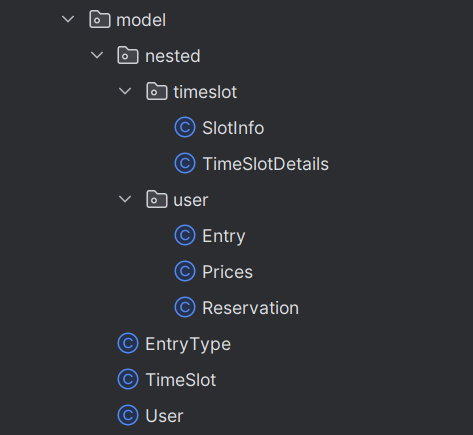
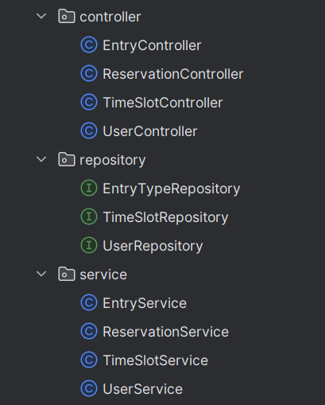

# Climbing Gym

### Autorzy: Zuzanna Jedynak i Jakub Prygiel

Projekt na Bazy Danych 2. Został zrealizowany z użyciem nierelacyjnej bazy MongoDB, a implementacje operacji CRUD i żądań HTTP zostały napisane w Javie z pomocą framework'a Spring Boot. Wszystkie testy zapytań i odpowiedzi były przeprowadzane w Postman'ie.

---

## Zamysł bazy danych

Baza danych to system rezerwacji na ściankę wspinaczkową. Składa się z trzech kolekcji: `users`, `time_slots` oraz `entry_types`. Wykorzystaliśmy właściwości dokumentowego formatu MongoDB i użyliśmy zagnieżdżeń aby utrzymać więcej informacji w pojedynczych tabelach.

#### `users`

```json
{
  "id": "u1",
  "firstname": "Harry",
  "lastname": "Potter",
  "entries": [
    {
      "type": "Regular",
      "prices": {
        "regular": 35.0,
        "reduced": 20.0
      },
      "deadline": "2025-07-20",
      "amount": 3,
      "entry_id": "e1"
    }
  ],
  "reservations": [
    {
      "reservationId": "r1",
      "date": "2025-07-01",
      "status": "A",
      "day_time": "morning",
      "people_amount": 3
    }
  ],
  "register_date": "2024-01-15"
}
```

Każdy użytkownik poza podstawowymi informacjami jak imię, nazwisko, posiada także dwie listy. Listę `entries` trzymającą wszystkie zakupione wejściówki oraz listę `reservations` trzymającą wszystkie wykonane przez użytkownika rezerwacje na ściankę wspinaczkową.

#### `time_slots`

```json
{
  "id": "ts_2025-07-01",
  "date": "2025-07-01",
  "details": {
    "morning": {
      "maxSlots": 20,
      "reservedSlots": 3
    },
    "noon": {
      "maxSlots": 30,
      "reservedSlots": 0
    },
    "evening": {
      "maxSlots": 20,
      "reservedSlots": 0
    }
  }
}
```

Rezerwacje są jedynie na konkretną porę dnia, stąd w `time_slots` przetrzymywane są dni z podziałem na ranek, południe i wieczór, zawierają ogarniczenie miejsc i na bieżąco aktualizowaną ilość miejsc zajętych.

#### `entry_types`

```json
{
  "id": "684d6d6e91f03f5ae49b5260",
  "name": "Four entries",
  "prices": {
    "regular": 110.0,
    "reduced": 90.0
  },
  "uses": 4,
  "entry_type": "4_entries",
  "day_limit": 30
}
```

Kolekcja utrzymująca wszystkie możliwe do zakupienia wejściówki, trzyma informacje o cenach, ilości wejść, oraz ograniczeniu czasowym na wykorzystanie.

## Implementacja backend'u

Najpierw zostały stworzone klasy przetrzymujące obiekty z bazy.



Klasy `User`, `TimeSlot` i `EntryType` są oznaczone adnotacją `@Document`, co informuje Spring Data MongoDB, że odpowiadają konkretnym kolekcjom w bazie danych. Dzięki temu framework automatycznie mapuje obiekty tych klas na dokumenty w MongoDB i umożliwia ich zapisywanie oraz odczytywanie z odpowiednich kolekcji.

```java
@Document(collection = "users")
public class User {
    public User(){}

    @Id
    private String id;
    private String firstname;
    private String lastname;
    @JsonProperty("register_date")
    @Field("register_date")
    private LocalDate registerDate;
    private List<Entry> entries;
    private List<Reservation> reservations;

    // GETTERS AND SETTERS
    ...
}
```

### Struktura aplikacji

Następnie dla każdej kolekcji powstało `Repository`, `Service` i `Controller`.



1. `Repository` to interfejsy dziedziczące po `MongoRepository`, które automatycznie udostępniają gotowe metody do podstawowych operacji CRUD (create, read, update, delete). Dodatkowo pozwalają definiować własne, proste metody zapytań, oparte na nazwach metod, bez potrzeby pisania ich ręcznie.

   ```java
   @Repository
   public interface TimeSlotRepository extends MongoRepository<TimeSlot, String> {
       Optional<TimeSlot> findByDate(LocalDate date);
   }
   ```

2. `Service` to klasy zajmujące się główną logiką aplikacji - walidacją danych, obsługą wyjątków, operacjami transakcyjnymi. Pośredniczą między `Repository` a `Controller`.

   ```java
   @Service
   public class TimeSlotService {

       @Autowired
       private TimeSlotRepository timeSlotRepository;

       public Iterable<TimeSlot> getAllTimeSlots() {
           return timeSlotRepository.findAll();
       }

       public Optional<TimeSlot> getTimeSlotByDate(LocalDate date) {
           return timeSlotRepository.findByDate(date);
       }

       ...
   }
   ```

3. `Controller`to **punkt wejścia** do aplikacji – obsługuje żądania HTTP i na nie odpowiada, definiuje endpoint'y. Przyjmuje dane z`@RequestBody`i`@PathVariable`, następnie w swoich metodach odwołuje się do `Service`i zwraca odpowiedź w formie`ResponseEntity<>()`.

   ```java
   @RestController
   @RequestMapping("/api/time-slots")
   @CrossOrigin(origins = "*")
   public class TimeSlotController {

       @Autowired
       private TimeSlotService timeSlotService;

       @GetMapping
       public ResponseEntity<Iterable<TimeSlot>> getAllTimeSlots() {
           Iterable<TimeSlot> timeSlots = timeSlotService.getAllTimeSlots();
           return new ResponseEntity<>(timeSlots, HttpStatus.OK);
       }
   }
   ```

### Podstawowe operacje CRUD

Dla każdej kolekcji zostały zaimplementowane operacje CRUD. Ich logika (oparta na gotowych metodach udostępnianych przez `Repository`) została umieszczona w warstwie `Service`. Następnie `Controller` odpowiada za obsługę żądań i wywoływanie odpowiednich metod serwisowych.

Podgląd implementacji operacji dla `users`

\pagebreak

```java
@Service
public class UserService {

    @Autowired
    private UserRepository userRepository;

    // Create
    public User createUser(User user) {
        if (user.getRegisterDate() == null) {
            user.setRegisterDate(LocalDate.now());
        }
        return userRepository.save(user);
    }

    // Read
    public List<User> getAllUsers() {
        return userRepository.findAll();
    }

    // Delete
    public void deleteUser(String id) {
        if (userRepository.existsById(id)) {
            userRepository.deleteById(id);
        } else {
            throw new RuntimeException("User not found with id: " + id);
        }
    }

    // Update
    public User updateUser(String id, User updatedUser) {
        return userRepository.findById(id)
                .map(user -> {
                    user.setFirstname(updatedUser.getFirstname());
                    user.setLastname(updatedUser.getLastname());
                    if (updatedUser.getRegisterDate() != null) {
                        user.setRegisterDate(updatedUser.getRegisterDate());
                    }
                    if (updatedUser.getEntries() != null) {
                        user.setEntries(updatedUser.getEntries());
                    }
                    if (updatedUser.getReservations() != null) {
                        user.setReservations(updatedUser.getReservations());
                    }
                    return userRepository.save(user);
                })
                .orElseThrow(() -> new RuntimeException("User not found with id: " + id));
    }
```

```java
@RestController
@RequestMapping("/api/users")
@CrossOrigin(origins = "*")
public class UserController {

    @Autowired
    private UserService userService;

    // Basic CRUD actions ============================================================
    // Create
    @PostMapping
    public ResponseEntity<User> createUser(@RequestBody User user) {
        try {
            User createdUser = userService.createUser(user);
            return new ResponseEntity<>(createdUser, HttpStatus.CREATED);
        } catch (Exception e) {
            return new ResponseEntity<>(HttpStatus.BAD_REQUEST);
        }
    }

    // Read
    @GetMapping
    public ResponseEntity<List<User>> getAllUsers() {
        List<User> users = userService.getAllUsers();
        return new ResponseEntity<>(users, HttpStatus.OK);
    }

    // Delete
    @DeleteMapping("/{id}")
    public ResponseEntity<Void> deleteUser(@PathVariable String id) {
        try {
            userService.deleteUser(id);
            return new ResponseEntity<>(HttpStatus.NO_CONTENT);
        } catch (RuntimeException e) {
            return new ResponseEntity<>(HttpStatus.NOT_FOUND);
        }
    }

    // Update
    @PutMapping("/{id}")
    public ResponseEntity<User> updateUser(@PathVariable String id, @RequestBody User user) {
        try {
            User updatedUser = userService.updateUser(id, user);
            return new ResponseEntity<>(updatedUser, HttpStatus.OK);
        } catch (RuntimeException e) {
            return new ResponseEntity<>(HttpStatus.NOT_FOUND);
        } catch (Exception e) {
            return new ResponseEntity<>(HttpStatus.BAD_REQUEST);
        }
    }
```

### Transakcje

Aplikacja posiada wiele operacji transakcyjnych związanych z rezerwacjami oraz korzystaniem z wejściówek przez użytkowników. `@Transactional` to adnotacja w Springu, która zapewnia, że jeśli w funkcji zajdzie kiedykolwiek błąd - nastąpi rollback.

Metoda dodawania nowej rezerwacji do użytkownika. Aby rezerwacja się powiodła sprawdza następujące warunki: czy użytkownik istnieje, czy jest wystarczająca liczba miejsc na daną porę, czy użytkownik ma odpowiednią ilość wejściówek.

```java
@Transactional
public boolean addReservationToUser(String userId, Reservation reservation) {
    ReentrantLock lock = getTimeSlotLock(reservation.getDate(), reservation.getDayTime());
    lock.lock();

    try {
        User user = userService.getUserById(userId)
                .orElseThrow(() -> new RuntimeException("User not found with id: " + userId));

        if(reservation.getStatus() == 0){
            reservation.setStatus('A');
        }
        reservation.setReservationId(generateReservationId());
        LocalDate date = reservation.getDate();
        String dayTime = reservation.getDayTime();
        int peopleAmount = reservation.getPeopleAmount();
        if (!timeSlotService.checkSlotAvailability(date, dayTime, peopleAmount)) {
            throw new RuntimeException("Not enough slots available for reservation");
        }

        int userEntries = entryService.getUsersEntryCountForDate(userId, date)
                .values()
                .stream()
                .mapToInt(Integer::intValue)
                .sum();
        if(userEntries < reservation.getPeopleAmount()){
            throw new RuntimeException("Not enough entries available for people reserved");
        }

        user.getReservations().add(reservation);
        boolean timeSlotUpdated = timeSlotService.updateReservationCount(date, dayTime, peopleAmount, true);
        if (!timeSlotUpdated) {
            throw new RuntimeException("Failed to update time slot");
        }

        userService.updateUser(userId, user);
        return true;

    } catch (Exception e) {
        throw new RuntimeException("Failed to add reservation: " + e.getMessage(), e);
    } finally {
        lock.unlock();
    }
}
```

Metoda wykorzystania posiadanej wejściówki użytkownika. Sprawdza czy użytkownik istnieje oraz czy ma wystarczającą ilość wejściówek do wykorzystania.

```java
@Transactional
public boolean useEntry(String userId, String entryId, int amount) {
    ReentrantLock userLock = getUserLock(userId);
    userLock.lock();

    try {
       User user = userService.getUserById(userId)
                .orElseThrow(() -> new RuntimeException("User not found with id: " + userId));

        Entry entry = user.getEntries().stream()
                .filter(e -> e.getEntryId().equals(entryId))
                .findFirst()
                .orElseThrow(() -> new RuntimeException("Entry not found"));

        if (entry.getAmount() < amount) {
            throw new RuntimeException("Entry does not have enough uses");
        }

        entry.setAmount(entry.getAmount() - amount);
        userService.updateUser(userId, user);
        return true;

    } catch (Exception e) {
        throw new RuntimeException("Failed to use entry: " + e.getMessage(), e);
    } finally {
        userLock.unlock();
    }
}
```

Metoda zmieniająca stan rezerwacji na anulowany. Sprawdza czy istnieje użytkownik, czy posiada rezerwację i czy nie jest już za późno na jej anulowanie.

```java
@Transactional
public boolean cancelReservation(String userId, String reservationId) {
    try {
        User user = userService.getUserById(userId)
                .orElseThrow(() -> new RuntimeException("User not found with id: " + userId));

        Reservation reservation = user.getReservations().stream()
                .filter(r -> r.getReservationId().equals(reservationId))
                .findFirst()
                .orElseThrow(() -> new RuntimeException("Reservation not found"));

        ReentrantLock lock = getTimeSlotLock(reservation.getDate(), reservation.getDayTime());
        lock.lock();

        if(reservation.getDate().isAfter(LocalDate.now().minusDays(2))) {
            throw new RuntimeException("Reservation can be cancelled 3 days prior at latest");
        }
        reservation.setStatus('C');

        boolean timeSlotUpdated = timeSlotService.updateReservationCount(
                reservation.getDate(),
                reservation.getDayTime(),
                reservation.getPeopleAmount(),
                false
        );

        if (!timeSlotUpdated) {
            throw new RuntimeException("Failed to update time slot");
        }

        userService.updateUser(userId, user);
        lock.unlock();
        return true;
    } catch (Exception e) {
        throw new RuntimeException("Failed to cancel reservation: " + e.getMessage(), e);
    }
}
```

### Raporty

Aplikacja posiada jedną implementację widoku składającego raport z tego ile na każdy time_slot jest aktywnych rezerwacji. Na jego potrzebę powstała klasa `SlotReservationsView` która defniuje format dokumentu wynikowego, klasa zawiera podklasy `ReservationSummary` i `SlotStats` odpowiadające zagnieżdżeniom.

```java
public class SlotReservationsView {

    private LocalDate date;

    @JsonProperty("morning_reservations")
    private List<ReservationSummary> morningReservations;
    @JsonProperty("noon_reservations")
    private List<ReservationSummary> noonReservations;
    @JsonProperty("evening_reservations")
    private List<ReservationSummary> eveningReservations;
    @JsonProperty("morning_stats")
    private SlotStats morningStats;
    @JsonProperty("noon_stats")
    private SlotStats noonStats;
    @JsonProperty("evening_stats")
    private SlotStats eveningStats;

    public SlotReservationsView() {}
    public SlotReservationsView(LocalDate date) {
        this.date = date;
    }

    // GETTERS AND SETTERS
    ...

    // Inner classes
    public static class ReservationSummary {
        @JsonProperty("reservation_id")
        private String reservationId;
        @JsonProperty("user_name")
        private String userName;
        @JsonProperty("user_id")
        private String userId;
        @JsonProperty("people_amount")
        private int peopleAmount;

        private char status;

        public ReservationSummary() {}

        public ReservationSummary(String reservationId, String userName, String userId,
                                                            int peopleAmount, char status) {
            this.reservationId = reservationId;
            this.userName = userName;
            this.userId = userId;
            this.peopleAmount = peopleAmount;
            this.status = status;
        }

        // GETTERS AND SETTERS
        ...

    public static class SlotStats {
        @JsonProperty("max_slots")
        private int maxSlots;
        @JsonProperty("reserved_slots")
        private int reservedSlots;
        @JsonProperty("available_slots")
        private int availableSlots;
        @JsonProperty("active_reservations_count")
        private int activeReservationsCount;

        public SlotStats() {}

        public SlotStats(int maxSlots, int totalPeople, int activeReservationsCount) {
            this.maxSlots = maxSlots;
            this.reservedSlots = totalPeople;
            this.availableSlots = maxSlots - this.reservedSlots;
            this.activeReservationsCount = activeReservationsCount;
        }

        // GETTERS AND SETTERS
        ...
    }
}
```

Główna funkcja z `ViewService` odpowiadająca za generowanie danych do raportu.

```java
public SlotReservationsView getTimeSlotReservationsView(LocalDate date) {
    SlotReservationsView view = new SlotReservationsView(date);
    List<User> allUsers = userService.getAllUsers();
    TimeSlot timeSlot = timeSlotService.getOrCreateTimeSlot(date);

    List<SlotReservationsView.ReservationSummary> morningReservations = new ArrayList<>();
    List<SlotReservationsView.ReservationSummary> noonReservations = new ArrayList<>();
    List<SlotReservationsView.ReservationSummary> eveningReservations = new ArrayList<>();

    for (User user : allUsers) {
        for (Reservation reservation : user.getReservations()) {
            if (reservation.getDate().equals(date) && reservation.getStatus() == 'A') {
                SlotReservationsView.ReservationSummary summary = new SlotReservationsView.ReservationSummary(
                        reservation.getReservationId(),
                        user.getFirstname() + " " + user.getLastname(),
                        user.getId(),
                        reservation.getPeopleAmount(),
                        reservation.getStatus()
                );

                switch (reservation.getDayTime().toLowerCase()) {
                    case "morning":
                        morningReservations.add(summary);
                        break;
                    case "noon":
                        noonReservations.add(summary);
                        break;
                    case "evening":
                        eveningReservations.add(summary);
                        break;
                }
            }
        }
    }

    view.setMorningReservations(morningReservations);
    view.setNoonReservations(noonReservations);
    view.setEveningReservations(eveningReservations);

    view.setMorningStats(calculateSlotStats(timeSlot.getDetails().getMorning().getMaxSlots(),
            morningReservations));
    view.setNoonStats(calculateSlotStats(timeSlot.getDetails().getNoon().getMaxSlots(),
            noonReservations));
    view.setEveningStats(calculateSlotStats(timeSlot.getDetails().getEvening().getMaxSlots(),
            eveningReservations));

    return view;
}
```

Widok można uruchomić dla

- konkretnej daty
- dnia dzisiejszego
- wszystkich nadchodzących 30 dni

```java
@RestController
@RequestMapping("/api/view")
@CrossOrigin(origins = "*")
public class ViewController {

    @Autowired
    private ViewService viewService;

    @GetMapping
    public ResponseEntity<SlotReservationsView> getTimeSlotReservations(
            @RequestParam @DateTimeFormat(iso = DateTimeFormat.ISO.DATE) LocalDate date) {
        try {
            SlotReservationsView view = viewService.getTimeSlotReservationsView(date);
            return new ResponseEntity<>(view, HttpStatus.OK);
        } catch (Exception e) {
            return new ResponseEntity<>(HttpStatus.INTERNAL_SERVER_ERROR);
        }
    }

    @GetMapping("/today")
    public ResponseEntity<SlotReservationsView> getTodayTimeSlotReservations() {
        try {
            SlotReservationsView view = viewService.getTimeSlotReservationsView(LocalDate.now());
            return new ResponseEntity<>(view, HttpStatus.OK);
        } catch (Exception e) {
            return new ResponseEntity<>(HttpStatus.INTERNAL_SERVER_ERROR);
        }
    }

    @GetMapping("/month")
    public ResponseEntity<List<SlotReservationsView>> monthTimeSlotReservations() {
        try {
            LocalDate today = LocalDate.now();
            LocalDate weekEnd = today.plusDays(30);
            List<SlotReservationsView> views = viewService.getTimeSlotReservationsViewRange(today, weekEnd);
            return new ResponseEntity<>(views, HttpStatus.OK);
        } catch (Exception e) {
            return new ResponseEntity<>(HttpStatus.INTERNAL_SERVER_ERROR);
        }
    }
}
```
\pagebreak
Dokument wynikowy po wywołaniu żądania GET na `/api/view` z parametrem `date = 2025-07-01`

```json
{
  "date": "2025-07-01",
  "morning_reservations": [
    {
      "status": "A",
      "reservation_id": "r1",
      "user_name": "Harry Potter",
      "user_id": "u1",
      "people_amount": 3
    }
  ],
  "noon_reservations": [],
  "evening_reservations": [],
  "morning_stats": {
    "max_slots": 20,
    "reserved_slots": 3,
    "available_slots": 17,
    "active_reservations_count": 1
  },
  "noon_stats": {
    "max_slots": 30,
    "reserved_slots": 0,
    "available_slots": 30,
    "active_reservations_count": 0
  },
  "evening_stats": {
    "max_slots": 20,
    "reserved_slots": 0,
    "available_slots": 20,
    "active_reservations_count": 0
  }
}
```
\pagebreak
### Kontrola równoczesnego dostępu do danych

Aby zapobiec równoczesnych zmianach w danych, które mogą prowadzić do błędów, używana jest współbieżna mapa `ConcurrentHashMap` trzymająca blokady `ReentrantLock` dla konkretnych danych. Przy rozpoczęciu operacji dane są blokowane, a dostęp do nich pozostaje zablokowany aż do zakończenia transakcji, co zapewnia bezpieczeństwo i spójność podczas jednoczesnych żądań wielu użytkowników.

Użycie w `ReservationService`

```java
private final ConcurrentHashMap<String, ReentrantLock> timeSlotLocks = new ConcurrentHashMap<>();
private ReentrantLock getTimeSlotLock(LocalDate date, String dayTime) {
    String lockKey = date.toString() + "-" + dayTime.toLowerCase();
    return timeSlotLocks.computeIfAbsent(lockKey, k -> new ReentrantLock());
}
```

```java
@Transactional
public boolean addReservationToUser(String userId, Reservation reservation) {
    ReentrantLock lock = getTimeSlotLock(reservation.getDate(), reservation.getDayTime());
    lock.lock();
    try {
        ...
    } finally {
      lock.unlock();
    }
}
```

## Frontend
Zdecydowaliśmy sie dodać do naszego projektu frontend. Użyliśmy React + Vite, a do komunikacji z backendem używamy fetch, np: 
```js
fetch("http://localhost:8080/api/users")
```
aplikacje uruchamiamy w folderze climbing-gym-frontend, za pomocą komendy npm run dev. Domyślnie uruchomi się ona na http://localhost:5173
